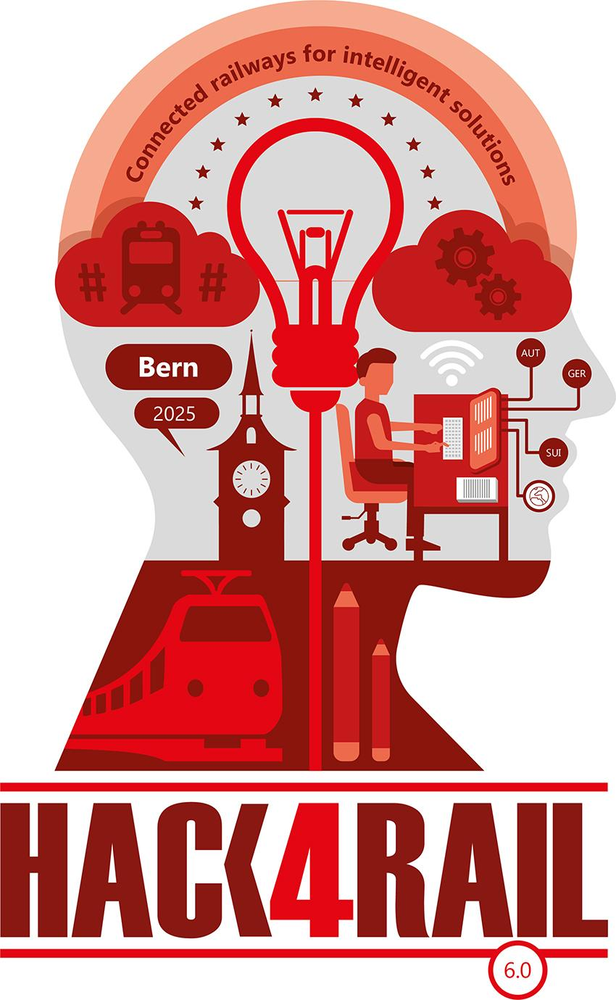

# Our Cool Project

*Short description what the project is about*

## Background

  

This project has been initiated during the [Hack4Rail 2025](https://hack4rail.event.sbb.ch/en/), a joint hackathon organised by the railway companies SBB, ÖBB, and DB in partnership with the OpenRail Association.

## Install

*How can a user install the software?*

## License

<!-- If you decide for another license, please change it here, and exchange the LICENSE file -->

The content of this repository is licensed under the [Apache 2.0 license](LICENSE).
